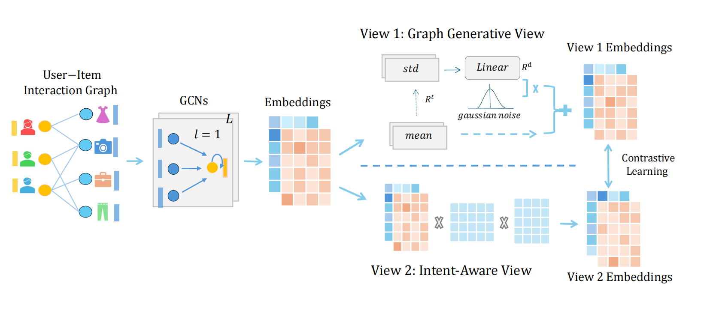

## Dual-View Graph Contrastive Learning for Recommendation

<p align="center">

</p>

## Environment
```
python == 3.12.4
pytorch == 2.4.1 (cuda:12.4)
torch-sparse == 0.6.18
scipy == 1.13.1
numpy == 1.26.4
```


## Examples to run the codes
We adopt three widely used large-scale recommendation datasets: Gowalla, Amazon-Book, and Tmall. The following are examples of runs on three datasets:

- Gowalla:

  `python main.py --dataset gowalla`
- Amazon-Book:

  `python main.py --dataset amazon `
- Tmall:

  `python main.py --dataset tmall`

